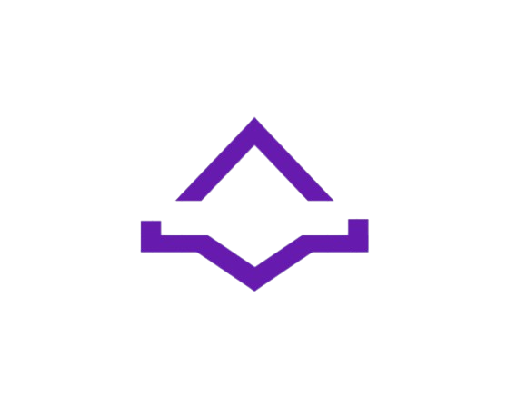
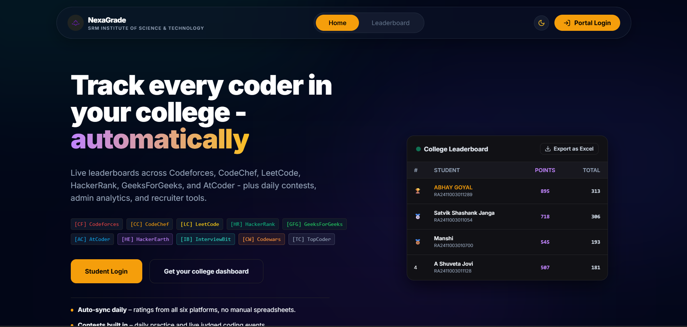
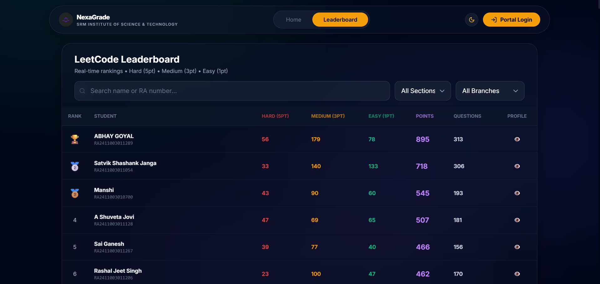
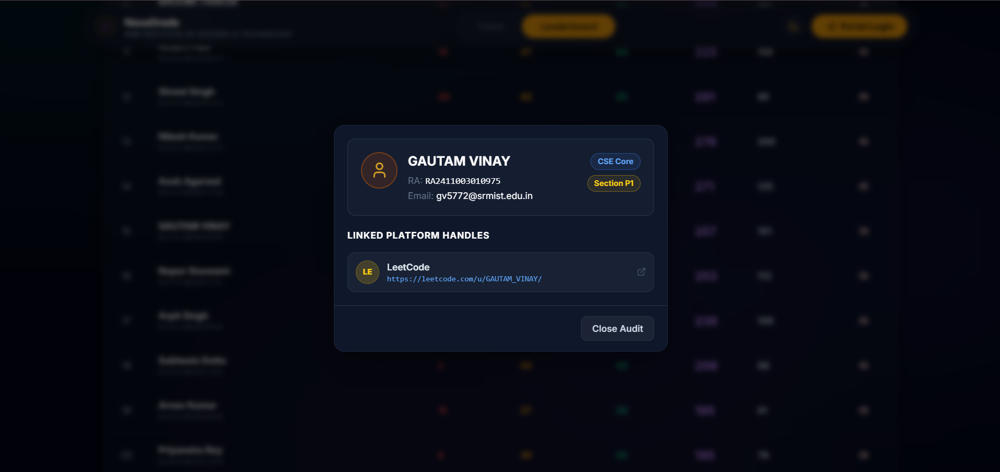

<div align="center">
  <br/>
  <!-- Logo and Title side-by-side -->
  <a href="https://nexagrade.vercel.app/">
    
    
  </a>
  
  <!-- Developer Signature -->
  <p><sub>Made by Gautam Vinay (aka ASPHODEL)</sub></p>
  
  <!-- Compact Subtitle in Light Purple -->
  <a href="https://nexagrade.vercel.app/">
    
  </a>
  
  <br/><br/>
  
  <!-- Royal Purple & Gold Live Demo Button -->
  <a href="https://nexagrade.vercel.app/">
    
  </a>
  <br/><br/>
</div>

<!-- Tech Stack -->
<div align="center">
  <a href="https://skillicons.dev">
    
  </a>
</div>

---

## About The Project

**NexaGrade** is a modern educational leaderboard built to track and rank student coding metrics. Hosted live at **[nexagrade.vercel.app](https://nexagrade.vercel.app/)**, it automates the tracking process by securely pulling live data directly from LeetCode APIs. 

The frontend focuses heavily on a premium, interactive user experience, utilizing modern web design principles like glassmorphism, dynamic cursor-tracking gradients, and a highly responsive dark-mode UI.

<!-- Core Features -->
<table align="center" style="width: 100%; border-collapse: collapse;">
  <tr>
    <td align="center" width="50%" style="padding: 20px; border: 1px solid #1e293b;">
      <h3>Data Sync</h3>
      <p>Automated API polling directly from LeetCode. Zero manual faculty entry required.</p>
    </td>
    <td align="center" width="50%" style="padding: 20px; border: 1px solid #1e293b;">
      <h3>Ranking Engine</h3>
      <p>Dynamic scoring calculated using: <code>(Hard * 5) + (Medium * 3) + (Easy * 1)</code>.</p>
    </td>
  </tr>
  <tr>
    <td align="center" width="50%" style="padding: 20px; border: 1px solid #1e293b;">
      <h3>Modern UI/UX</h3>
      <p>Built with cursor-tracking gradients, glassmorphism backdrops, and fluid animations.</p>
    </td>
    <td align="center" width="50%" style="padding: 20px; border: 1px solid #1e293b;">
      <h3>Faculty Audit</h3>
      <p>Optimized profile modal displaying student RA, platform handles, and section details.</p>
    </td>
  </tr>
</table>

---

## Visuals

<div align="center">
  
  <br/><br/>
  
  <br/><br/>
  
</div>

---

## Local Setup

To run this project locally:

```bash
# 1. Clone the repository
git clone [https://github.com/GautamVinay/NexaGrade.git](https://github.com/GautamVinay/NexaGrade.git)

# 2. Install dependencies
npm install

# 3. Setup your .env file with your Neon DB credentials
# 4. Run the development server
npm run dev
```
